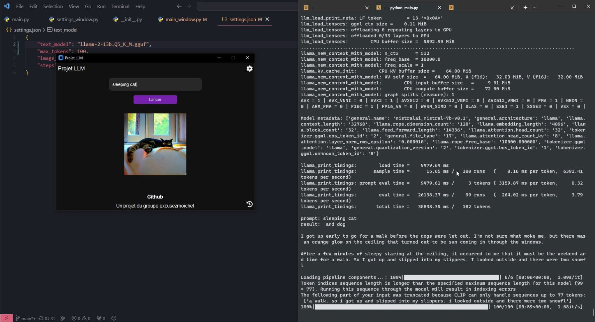
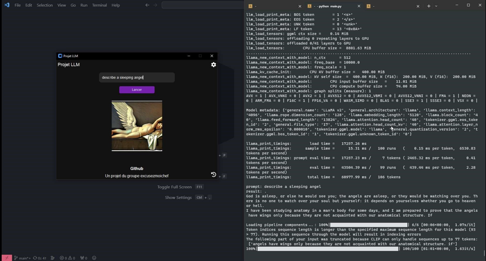

# Excusez-moi chef

## Présentation du projet

Notre projet permet de générer une histoire via l'IA nommée llama2, une autre IA nommé stable diffusion permet de l'illustrer.

Vous retrouverez les manipulations nécessaires pour installer et lancer notre application dans la suite de ce document.

## Membres

- Djelal Boudji
- Edouard Rinaldi
- Vincent Pett
- Tristan Durieux

## Accessibilité

Pour ajouter des fonctionnalités, corriger des bugs, installer le projet, vous pouvez effectuer la commande suivante depuis votre terminal...


```bash
git clone https://github.com/excusezmoichef/llm.git
```

Ou depuis votre invite de commande Github...
```bash
gh repo clone excusezmoichef/llm
```


## Démonstration

Dans cette partie vous pouvez retrouver les différentes démonstration.

Voici une capture d'écran de notre application en action, créant une image avec un chat dormant.



Voici une capture d'écran de notre application en action, créant une image avec un ange dormant.



## Installation

### Prérequis

### Windows

### Linux


## Licence

[MIT](https://github.com/La-trollsquad/llm/blob/main/LICENSE)